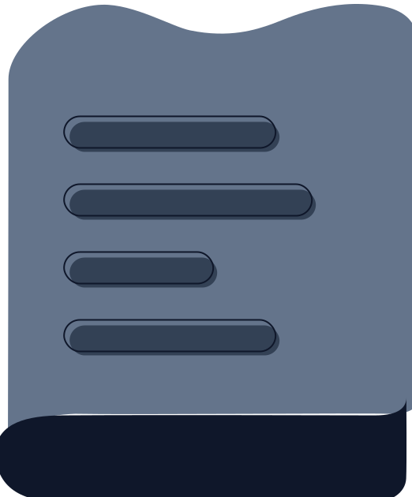

<div align="center">


# Slate

<span>Web based note-taking for power users.</span>

[](https://reactjs.org/) [](https://www.typescriptlang.org/) [](https://vitejs.dev/) [](https://tiptap.dev/) [](LICENSE)

</div>

## ✨ Features

- **Rich Text Editor**: Powered by TipTap with support for all common formatting options
- **Intuitive Note Management**: Organize notes in folders with a clean, responsive sidebar
- **Theme Customization**: Multiple built-in themes with light and dark mode support
- **Command Bar**: Quick access to all app functions with keyboard shortcuts (Ctrl+K)
- **Responsive Design**: Works seamlessly on desktop and mobile devices
- **Local Storage**: All notes are stored locally in your browser
- **Modern UI**: Built with Tailwind CSS and Shadcn UI components

## 🚀 Getting Started

### Prerequisites

- Node.js (v22 or higher)
- pnpm (or npm)

### Installation

1. Clone the repository

```bash
git clone https://github.com/threehymns/slate.git
cd slate
```

2. Install dependencies

```bash
pnpm install
# or
npm install
```

3. Start the development server

```bash
pnpm dev
# or
npm run dev
```

4. Open your browser and navigate to `http://localhost:5173`

## 🏗️ Building for Production

```bash
pnpm build
# or
npm run build
```

The built files will be in the `dist` directory.

## 🧩 Project Structure

```
slate/
├── public/              # Static assets
├── src/
│   ├── components/      # React components
│   │   └── ui/          # UI components (shadcn/ui)
│   ├── hooks/           # Custom React hooks
│   ├── lib/             # Utility functions and theme definitions
│   ├── pages/           # Page components
│   ├── store/           # State management (Zustand)
│   └── types/           # TypeScript type definitions
├── index.html           # Entry HTML file
└── package.json         # Project dependencies and scripts
```

## 🎨 Theming

Slate comes with several built-in themes that can be selected from the Settings page. Themes include both light and dark variants that automatically switch based on your system preferences or manual selection.

## 🛠️ Technologies Used

- **Vite**: Build tool and development server
- **Shadcn UI**: Re-usable UI components
- **Tailwind CSS**: Utility-first CSS framework
- **TipTap**: Extensible rich text editor framework
- **Zustand**: State management and persistence
- **Motion**: Animation framework
- **React Router**: Client-side routing

## 🤝 Contributing

Contributions are welcome! Please feel free to submit a Pull Request.

1. Fork the repository
2. Create your feature branch (`git checkout -b feature/amazing-feature`)
3. Commit your changes (`git commit -m 'Add some amazing feature'`)
4. Push to the branch (`git push origin feature/amazing-feature`)
5. Open a Pull Request

## 📄 License

This project is licensed under the MIT License - see the LICENSE file for details.

## 🙏 Acknowledgements

- [TipTap](https://tiptap.dev/) for the amazing editor
- [Shadcn UI](https://ui.shadcn.com/) for the beautiful components
- [Tailwind CSS](https://tailwindcss.com/) for the utility-first CSS framework
- [Zustand](https://zustand-demo.pmnd.rs/) for the state management
- [Vite](https://vitejs.dev/) for the blazing fast development experience
